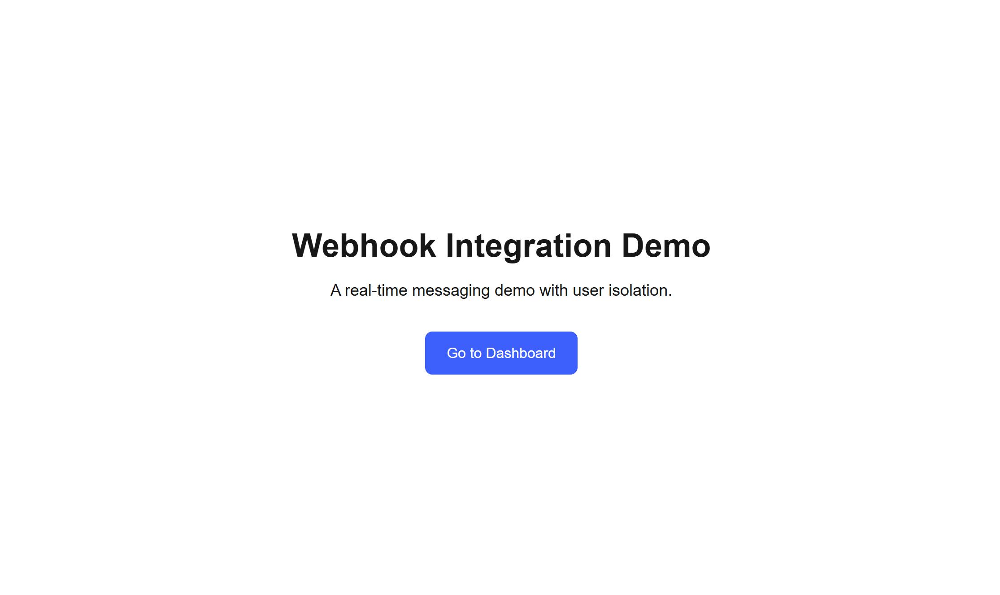
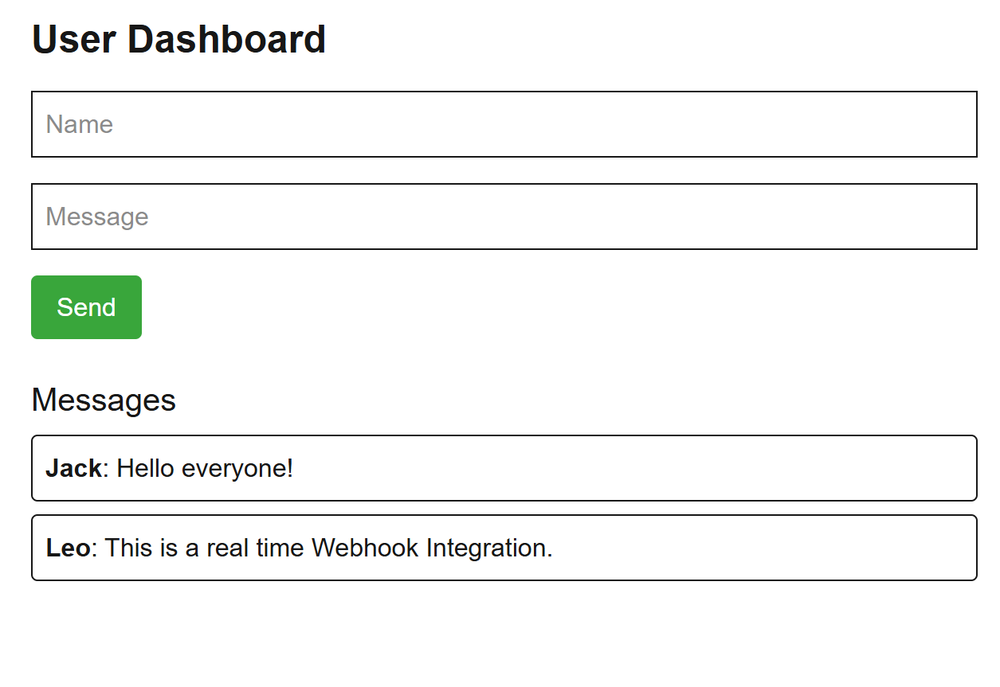

# Webhook Integration Demo

This project is a **real-time messaging application** built with [Next.js App Router](https://nextjs.org/docs/app), designed to demonstrate how webhooks and user-specific data isolation can be implemented in a modern web app.

Users can send messages to a backend webhook (built with Express.js), and messages are displayed **in near real-time**. The app ensures **user-level isolation**, so each user sees only their own messages.

---

## 🌐 Live Demo

Access the live version here 👉 [https://webhook-integration-app.vercel.app](https://webhook-integration-app.vercel.app)

---

## ✨ Features

- 📬 Form input: Name & Message
- 🔗 Sends data to an Express.js-based webhook
- 📡 Polls backend every 2s for latest messages
- 🔐 Each user has a unique ID stored in `localStorage`
- 📦 Built with Next.js 14, Tailwind CSS, TypeScript, Express.js

---

## 🖼️ Screenshots

### 🔹 Landing Page



### 🔹 Dashboard Page



---

## 🛠️ Technologies Used

| Stack | Tech |
|-------|------|
| Frontend | Next.js App Router, TypeScript, Tailwind CSS |
| Backend | Express.js with in-memory storage |
| Tools | UUID, localStorage, REST API |

---

## 🚀 Getting Started

### 🔧 1. Clone this repo

```bash
git clone https://github.com/XinJiyang/webhook-integration-app.git
cd webhook-integration-app
```

### 📦2. Install dependencies

```bash
npm install
```

### ▶️ 3. Start Next.js frontend

```bash
npm run dev
```
#### Runs at: http://localhost:3000

### 🖥️ 4. Start Express.js backend
#### Open a new terminal and run:

```bash
cd webhook-backend
node index.js
```
#### Runs at: http://localhost:4000

## 🌳Project Structure
<pre lang="markdown">plaintext webhook-integration-app/
├── src/
│   └── app/
│       ├── page.tsx           # Landing Page
│       └── dashboard/
│           └── page.tsx       # Dashboard: input + polling view
├── webhook-backend/
│   └── index.js               # Express.js API with in-memory store
</pre>

## 🔌 API Endpoints

POST `/webhook`
- Receives user-submitted `{ userId, name, message }`
- Stores messages in memory under `userId`

GET `/messages/:userId`
- Returns all messages for the specified user

## 📚 Notes

- User ID is persisted via localStorage to ensure messages stay user-specific
- Backend is currently in-memory only. Swap out with a real DB (e.g., MongoDB, Supabase, SQLite) for production use
- Frontend polls every 2 seconds; can be replaced by WebSocket for true real-time experience